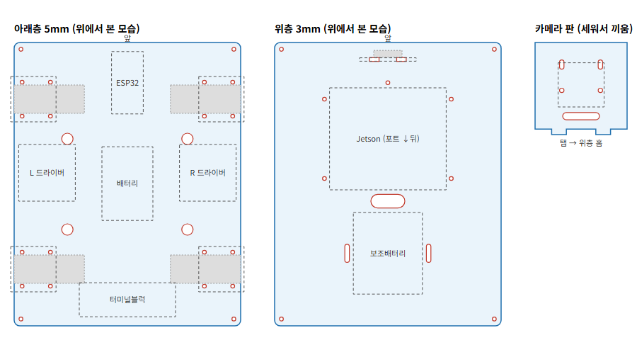

# 아크릴 2층 섀시

박스 섀시로 배치·치수를 확인한 뒤(2026-10-07~08) 그대로 옮긴 레이저 재단 도면이다.

- `chassis.dxf` — 재단용(R12, 단위 mm). 왼쪽부터 아래층 5T 200×250, 위층 3T 200×250, 카메라 판 3T 50×50
- `make_chassis.py` — 위 두 파일을 만드는 스크립트. 치수는 맨 위 상수에 모여 있다

| 항목 | 값 | 근거 |
|---|---|---|
| 바퀴 축선 | 앞에서 50 / 200mm | 박스 섀시 배치 |
| 브래킷 구멍 | 판 가장자리에서 7 · 32mm, 축선 ±15mm, M3 | 브래킷 실측 (바닥판 40×40, 구멍 30×25) |
| 브래킷 장착 | 바닥판은 판 위, 모터는 판 아래 | 바닥판-모터 틈 20mm에 5T 판이 들어감 |
| 층 사이 | 약 60mm | 아래층 최고 높이 40mm(배터리·드라이버·터미널블럭) + 배선 여유 |
| Jetson | 틀 103×90mm, 찍찍이 + 멈춤 기둥 5개 | 개발자 키트에 나사 구멍이 없음(플라스틱 틀) |
| 카메라 | 판을 세워 홈에 끼움, 위 구멍은 세로 긴 구멍 | 구멍 간격 실측 14mm가 RPi v2 표준(12.5)과 달라 오차 흡수 |
